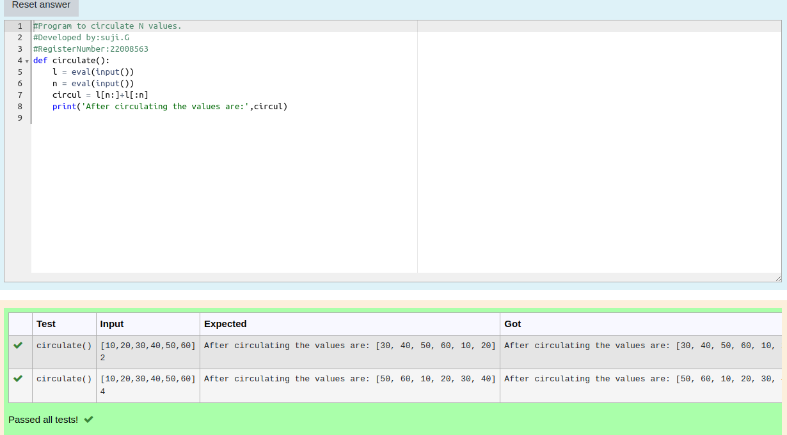

# Circulate-the-values-of-N-variables
## Aim:
To write a python program to circulate the n variables using function concept
## Equipment’s required:
PC
Anaconda - Python 3.7
## Algorithm: 
### Step 1: Get the two values from the user
### Step 2: Import def keyword and function_name
### Step 3: Get the value from the user for the number of rotation
### Step 4: Using the slicing concept rotate the list
### Step 5: Print the values after circulating the values
### Step 6: End the program
## Program:
```#Program to circulate N values.
#Developed by:suji.G 
#RegisterNumber:22008563
def circulate():
    l = eval(input())
    n = eval(input())
    circul = l[n:]+l[:n]
    print('After circulating the values are:',circul)
```
## Output:


## Result:
Thus the circulating value are sucessfully executed
